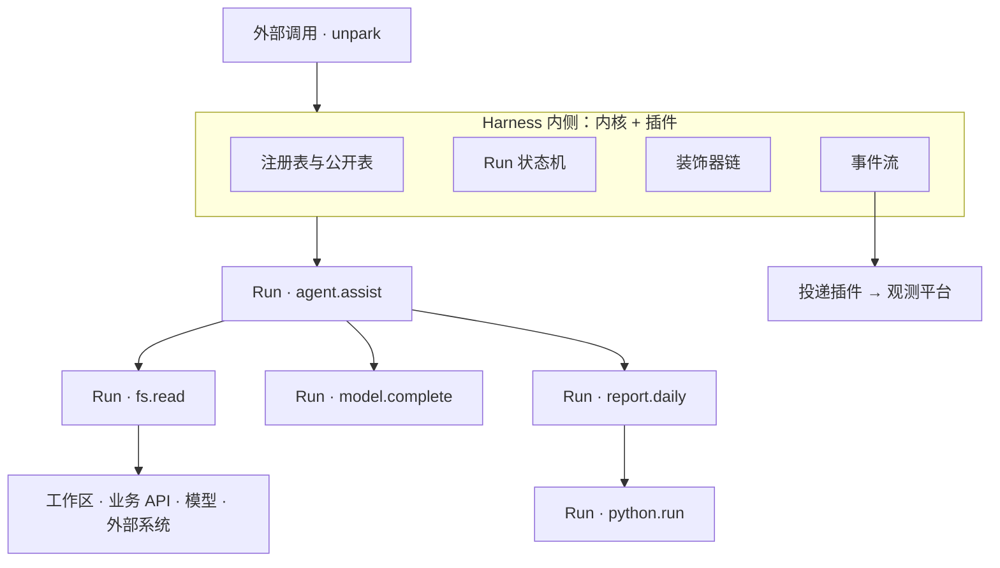
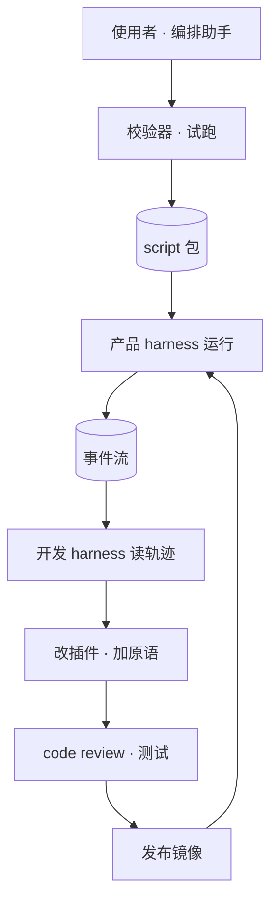
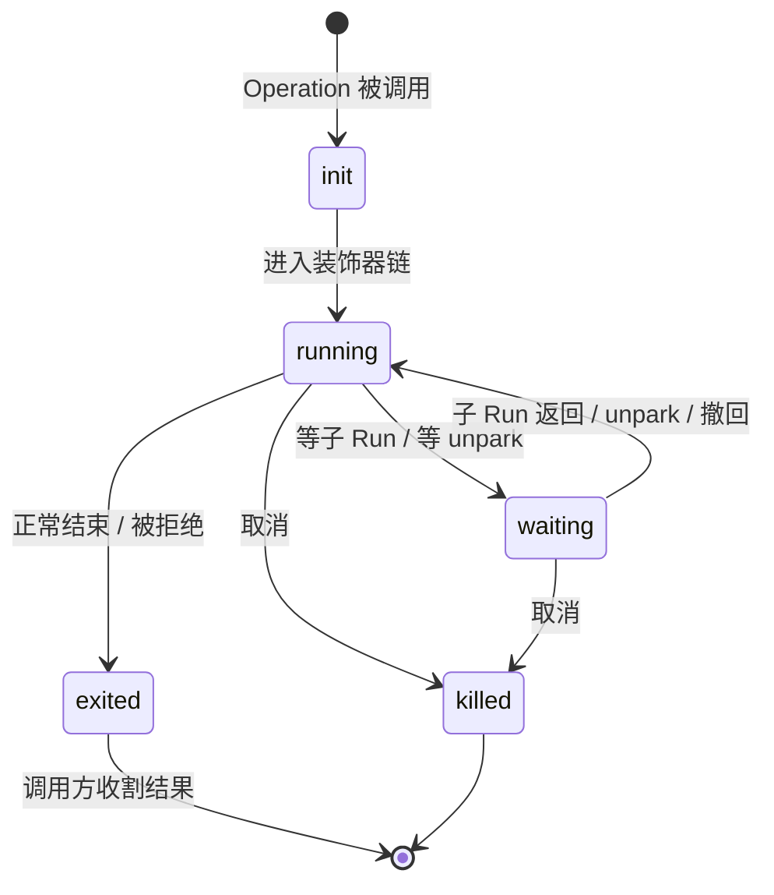

# 泛化 Harness 技术方案

> 状态：正文十一节已定稿。附 A 为字段速查，附 B 为设计理由，附 C 为待办。

---

# 1. 概述

## 1.1 要解决什么

同一个用户在同一件事上，需要不同身份和能力集轮流上场；能力本身也在不断增长——使用者想沉淀自己的流程，agent 想现场写一段代码把事办完。现有形态下，换身份要换进程或重启 agent，加能力要等一个发版周期，agent 执行的代码能碰到什么也说不清。

本方案达成六点：

- **切换快**：换身份就是调另一个 Operation，不重启进程、不重建沙箱
- **状态连续**：工作产物在共享的持久工作区里，任何身份都能接着干
- **上下文可控**：共享的是工作区，不是对话历史；带多少上下文由声明决定
- **能力可扩展**：写一个 script 包就能加能力，不用重建二进制
- **能力可控、可审计**：每个身份能碰什么是可枚举的；对外部世界的每次副作用都对应一次原语调用，全部进事件流
- **等待不烧钱**：等人或等外部回调期间沙箱可以回收，回来后从原处继续

## 1.2 定位

这是对「做一件事」的 harness，不是 LLM harness。一件事可以纯用代码完成，也可以在其中调模型，两者地位对等、可以互相嵌套。审批、限流、计费、审计、观测对两种链路一视同仁（R1）。

## 1.3 术语

| 术语 | 定义 |
|---|---|
| **Harness** | 交付物整体：一个二进制 + 一份产物 |
| **产物** | 随发布分发、可独立更新的目录：装配配置、script 包、内侧公开部分的 d.ts |
| **插件** | 二进制里的一个包，写法与 script 包相同，向内核贡献 Operation、装饰器、处理器、服务、挂点 |
| **script 包** | 产物里的一个包，由内核动态装载，贡献 Operation、装饰器、处理器 |
| **形态** | Operation 由谁提供：`native`（内核或插件）/ `script`（script 包） |
| **内侧 / 外侧** | 内侧是内核与插件，互相完全可见；外侧是 script 包，只看得到公开表 |
| **公开表** | 外侧能看到的全部：内侧标为公开的 Operation、装饰器、挂点、服务，加上各 script 包导出的函数；生成为 d.ts |
| **Operation** | 一项能力：一个带入参出参契约、用法说明、能力面与限额的函数，名为 `包名.函数名` |
| **原语** | 直接碰外部世界、不调别的 Operation 的 native Operation |
| **Run** | Operation 的一次执行，由状态机管理 |
| **能力面** | 一个 Run 能调用的 Operation 集合 |
| **装饰器** | 包裹一次调用的拦截与改写单元 |
| **挂点** | 可以挂处理逻辑的位置：装饰器链、生命周期责任链、通知、插件自定义挂点 |

## 1.4 全景



插件提供原语，script 包提供逻辑流程。每次调用都是一个 Run，都过装饰器链；外侧只能经内核的入口接触内侧，每次都查公开表。

---

# 2. 角色与两套 harness

## 2.1 三类角色

| 角色 | 在哪工作 | 改什么 | 靠什么把关 |
|---|---|---|---|
| **开发者** | 开发 harness | 内核、插件 | code review + 测试 + 发布流程 |
| **使用者** | 产品 harness 里的编排助手 | script 包 | 校验器 + 试跑 + 上架审核 |
| **终端用户** | 产品 harness | 自己的工作产物 | 能力面 + 装饰器 |

编排助手是产品 harness 里的一个普通 Operation：在工作区写包的草稿，用 `harness.exec` 试跑，提交后经校验器与上架审核进入下一版产物。

## 2.2 两套 harness

coding agent 跑在另一套 harness 里：同一个内核，换一组插件与 script 包（R2）。

| | 产品 harness | 开发 harness |
|---|---|---|
| 工作区 | 用户的工作产物 | 产品 harness 的 git 仓库 |
| 典型能力 | 业务 Operation、记忆、工作区、执行环境 | 读写代码、跑测试、发布到测试环境、读产品 harness 的轨迹 |
| 交付 | 业务结果 | 提交、镜像、产物 |

开发 harness 的三条专属策略：

- 发布类 Operation 默认需要人工确认（`park`，3.5），或只能发往测试环境
- 写权限的边界是插件目录；插件之间不共享代码、不能自封全局（6.4）作为对 coding agent 的硬约束
- 读产品 harness 的轨迹是一个只读 Operation，作为事件的普通消费者

## 2.3 自举闭环



使用者那条回路是分钟级（改产物），开发者那条是发版级（改镜像）。先在快回路摸索，稳定后沉淀到慢回路（7.7）。

---

# 3. 核心模型

## 3.1 两种形态，一条边界

一个 Run 在执行中调用别的 Operation，每次调用建立一个子 Run，一次外部调用展开成一棵 Run 树（R1）。Operation 的形态由提供者决定，不用字段声明（R3）：

| | 内侧 | 外侧 |
|---|---|---|
| 提供者 | 内核、插件 | script 包 |
| 形态 | `native` | `script` |
| 写法 | 一个包目录：导出函数即 Operation，JSDoc 写说明与标签，d.ts 与 schema 由同一个工具生成（6.1、7.3、R4） | 同左 |
| 代码在哪 | 二进制 | 产物，动态装载 |
| 在哪执行 | 内核进程 | 内核内嵌的解释器（7.5） |
| 能不能做 IO | 能，可以 import 宿主模块与 npm 库 | 不能，只能调 Operation |
| 信任 | 可信 | 不可信 |
| 看得到什么 | 全部 Operation、装饰器、挂点、服务（服务的提供方可以限定消费方） | 只有公开表（7.2） |
| 公开 | 标 `@public` 的才进公开表 | 导出的全部进公开表 |
| 能贡献什么 | Operation、装饰器、处理器、服务、自定义挂点 | Operation、装饰器、处理器 |
| 谁能改 | 开发者，走发版 | 使用者与 agent；试跑即时，上架经审核 |

规则只有一条：**内侧互相完全可见；外侧只能经内核给的入口接触其他代码，每次都查公开表，不在表里的按拒绝返回**（R5）。两侧的每次调用都过装饰器链。

两侧 import 别的包写法相同，打包时都换成按名字的调用，每次调用是一个子 Run：

```ts
import { read } from "fs";                          // 插件
import { completionScore } from "video-analysis";   // script 包
import { call, park } from "harness";               // 内核
```

## 3.2 native Operation 分三类

| | 做什么 | 例子 |
|---|---|---|
| **原语** | 直接碰外部世界，不调别的 Operation | `fs.read`、`model.complete`、`python.run` |
| **内侧编排** | 需要用到不公开 Operation 的编排；自己不直接做 IO，可以公开；模型可以参与判断，但不选下一步调谁 | `web.search` 编排不公开的 `web.searchRaw`、`web.fetchRaw` |
| **内核 Operation** | 内核自己提供 | `harness.park`、`harness.exec` |

其余编排都写成 script 包。由此，**Operation 对外部世界的每一次副作用都对应事件流里的一次原语调用**（R6）。

`web.search` 的做法：循环调 `web.searchRaw` 取结果，调 `model.complete`（`tools` 为空）让模型判断够不够、给出下一个查询，最多三轮后返回结论。网页正文只留在子 Run 里，调用方拿到的是结论。

## 3.3 agent-loop 是一个 script 包

出厂的 agent-loop 是 `agent` 包导出的 `assist`。使用者复制一份修改，就是自己的 loop（R7）：

```ts
// packages/agent/index.ts
import { complete, compact, type Message } from "model";
import { call, emit } from "harness";

const PERSONA = "你是 B 站创作助手，回答要简洁。";

/** 通用助理 */
export async function assist(input: { history: Message[] }): Promise<{ answer: string; history: Message[] }> {
  const { history } = await compact({ history: input.history, over: 60_000 });
  for (;;) {
    const out = await complete({ persona: PERSONA, history });
    history.push(out.message);
    if (out.calls.length === 0) return { answer: out.answer, history };

    emit("todo", out.calls.map((c) => c.name));
    const results = await Promise.all(out.calls.map((c) => call(c.name, c.args)));
    out.calls.forEach((c, i) => history.push({ role: "tool", call: c, result: results[i] }));
  }
}
```

ReAct、plan-execute 是不同的 script 包；人设、压缩时机、终止判据都写在脚本里。

## 3.4 Run 状态机



- **running**：实现在执行，包括原语在等网络或模型返回
- **waiting**：在等内核跟踪的东西——子 Run，或 unpark。`harness.park` 是唯一不靠子 Run 而进入 `waiting` 的 Run（R8）
- **配置冻结**：Run 出生时解析出配置，装饰器链走到实现的那一刻冻结，此后不可改；换配置只能起新 Run
- **结果等收割**：退出后结果保留到调用方取走；无人收割则以可查状态保留
- **不留悬空调用**：被 kill 的子 Run 以拒绝结果（`by` 为内核）回给等它的父。kill 只来自取消接口、祖先被 kill、关停与恢复失败
- **资源保险丝**：子 Run 深度加一；深度与同时存活的 Run 数有上限（装配配置 `kernel`），超出的调用以拒绝返回（R9）

## 3.5 挂起：park 与 unpark

| | 是什么 |
|---|---|
| `harness.park({ schema, payload })` | 内核提供的 Operation。它的 Run 进入 `waiting`，等一个符合 `schema` 的值；同时发 `park.opened` 事件，带上内核不解释的 `payload` |
| `unpark(id, value)` / `withdraw(id, reason)` | Harness 的对外接口：送值进来（按 `schema` 校验），或撤回；随后发 `park.closed` |
| 产出 | `{ ok: true, value }`；被撤回或短路时为 `{ ok: false, reason }` |

等人确认、等外部任务回调（比如渲染完成）、等另一个系统审批，都是 `park`（R10）。

**给人看的问题**由 `agent-ui` 包约定格式：`agent-ui.ask({ prompt, schema, options })` 以约定格式的 `payload` 调 `park`，UI 认识这个格式并渲染。`approval` 装饰器在 `next()` 之前直接以同一格式调 `harness.park`，据结果放行或拒绝。

**无人值守**是装配侧的决定：产物不装 `approval`，并装一个把 agent-ui 格式的 `park` 短路成 `{ ok: false, reason: "unattended" }` 的装饰器。

**多个 park 可以同时存在**，按 runId 各自等待、并列呈现；同时等待的数量设上限。

**空闲**：一棵树里没有 `running` 的 Run 时，整棵树空闲，这时所有叶子都是 park。空闲的树不算活跃，照常走空闲回收（9.4）；park 不设超时（R8）。

## 3.6 快照与恢复

**何时写、何时删**：树进入空闲时写一份快照；树里有 Run 重新进入 `running` 之前删掉——unpark 或撤回的值送进 park 之前先删。快照原子写入持久卷上的内核专属目录（装配配置 `snapshotDir`），任何原语都不可达（R11）。

| 快照内容 | 用途 |
|---|---|
| 树结构与每个 Run 的字段（附 A）：标识、入参、能力面、`context`、`limits`、`counters`、深度、父指针 | 重建 Run |
| 每个 Run 的调用记录：已完成的子调用（序号、目标、入参摘要、结果、完成顺序、`after`）、已发起的 `spawn`、脚本取到的时间与随机数 | 重放 |
| 等待中的 park：id、`schema`、`payload` | 接回等待 |
| 产物摘要 | 与当前一致才恢复；镜像版本不同时照常恢复，由逐调用比对兜底 |

调用栈与解释器状态不进快照。

**恢复**：进程启动时逐份读取快照（R12）：

1. 重建树里的 Run
2. 从根开始，每个 Run 按原入参重新执行——script、内侧编排、`harness.exec` 与装饰器前半段；`run.replaying` 为真
3. 每次发起的调用与 `spawn` 按「序号、目标、入参」比对记录：
   - **已完成**：按原完成顺序回送记录的结果；不真正执行、不过装饰器链；已发起过的 `spawn` 不再发起，`emit` 的事件不再发出
   - **在途**：接回重建的子 Run，它同样重新执行
4. 每个 Run 回放到记录末尾时 `run.replaying` 置为假。park 重新进入 `waiting`，id 不变；树回到写快照时的状态，快照保留到树再次活跃

回放期间：入参与 `context` 取快照值，装饰器对它们的写入不生效；装饰器据 `run.replaying` 跳过不经过调用的副作用；不发通知。

**恢复失败**：摘要不一致或比对不上时，整棵树按 `killed` 处理，其下全部 park 作废，根 Run 以结构化失败结果供收割，并告知用户；快照删除。

恢复发一条关键级事件：来自哪份快照、哪些 Run 重新执行、多少调用回放，或失败原因（9.6）。

## 3.7 不变量

1. **配置冻结**：实现开始执行后 Run 的配置不可变
2. **单一出口**：Operation 对外部世界的一切副作用都发生在原语里，每次原语调用都过装饰器链
3. **拒绝也是结果**：管控短路以调用结果返回，不留悬空调用
4. **留痕可复现**：生效的能力面、默认装饰器集、链上每一环的处置、产物版本全部入事件流
5. **业务判断不在内核**：内核只做调度、发事件、公开表与能力面的可见性检查，以及深度与存活 Run 数两个资源保险丝；用量、限额、审批等判断由装饰器承担
6. **要智能就起 Run**：插件不直接调模型，需要智能就调一个 Operation
7. **一条边界**：内侧互相可见，外侧只见公开表；两侧的调用都过装饰器链

---

# 4. 能力面

## 4.1 规则

| 规则 | 内容 |
|---|---|
| 缺省 | native Operation 能调全部 Operation；script Operation 能调公开表里的全部 Operation（含其他 script 包导出的） |
| 收窄 | 两种形态都可以用 `@only` / `@exclude` 收窄，写 Operation 名或包名；两者同时出现先 `@only` 再 `@exclude` |
| 不继承 | 子 Run 的能力面只由被调的 Operation 自己决定，与调用方无关 |
| 强制 | 每次调用检查目标是否在**发起方自己**的能力面里，不在则以拒绝返回 |
| 装饰器与处理器 | 它们发起的调用不查被装饰 Run 的能力面：内侧的不查，外侧的只查公开表 |
| 静态 | 能力面在 Run 内冻结 |

收窄不承担安全职责，安全由公开表决定（7.2）。收窄的用途是省 token 与收敛模型行为：`model.complete` 缺省把调用方能力面里公开的 Operation 交给模型作为工具（8.1、R13）。

## 4.2 什么跟着委托链走

内核只让**深度**跟着委托链走（子 Run 加一，3.4）。用量记在产生它的 Run 上，要不要汇总到父、怎么汇总由 budget 插件决定（9.5）。

其余都是入参，由调用方按被调 Operation 的契约填写：工作区路径（可以共用父的目录，也可以指向隔离目录）、交接内容、带不带对话历史。「默认继承父的工作区」这类行为是契约的默认值，不是内核机制。

## 4.3 静态与动态的边界

| 层 | 谁定 | 何时定 |
|---|---|---|
| **能力面**：能调谁、限额多少 | Operation 的声明 | 静态，Run 内冻结 |
| **编排**：调用顺序、跳过哪步、试几次、何时委托 | Operation 的代码 | agent-loop 里由模型即兴决定，其余写定 |
| **方法论**：这类事按什么步骤做 | Skill | 运行时按需加载 |

对应的修改路径：想改**怎么做**，写 Skill，随产物发布生效；想改**能做什么**，写一个 script 包或一个原语；一次性、需试错的任务，委托一个子 Run 去闭环，结果用完即弃或登记为新的包。

---

# 5. 装饰器与挂点

## 5.1 挂点

| 挂点 | 时机 | 公开给 script 包 |
|---|---|---|
| **装饰器链** | 每次调用 | 是 |
| **生命周期责任链** | `harness.stopping`（关停）、`run.cancelling`（取消单个 Run） | 否 |
| **通知** | 事件流里的每条事件（9.1），常用的有 `run.started` / `run.exited` / `run.killed` / `park.opened` / `park.closed` / `run.delta` / `harness.started` | 是（只含公开表里 Operation 的事件） |
| **插件自定义挂点** | 由插件定义，比如 memory 插件的「保存前」 | 由插件决定 |

装饰器在链上（有序、可改写）；生命周期责任链有序、内核会等它走完；通知是广播（无序、只读）（R14）。

## 5.2 装饰器

一个装饰器就是一个包裹：`(run, next) => result`。

- `next` 之前：改入参、往 `run.context` 放条目、读能力面——配置尚未冻结
- `next` 之后：改结果、结算、审最终值

**顺序**：默认装饰器在外，自选装饰器在内，同层按书写顺序嵌套。要审最终值的装饰器必须在最外层（R15）。

| 来源 | 声明在哪 | 典型 |
|---|---|---|
| **默认装饰器** | 装配配置 `defaultDecorators`，只能是内侧的 | 安全、用量、审计 |
| **自选装饰器** | Operation 自己的 `@decorators`：native 只能引用内侧的，script 可以引用公开表里的 | 记忆召回、结果格式化、特定校验 |

- 默认集由装配侧决定，只能放内侧的装饰器；插件与 script 包都不能自封全局（R14）
- 装饰器不继承：子 Run 用它自己 Operation 的自选装饰器加同一份默认集
- 链对每一次调用都跑，不区分被调的是 native 还是 script、是外部调用还是委托
- 挂在不同层级得到不同粒度：挂在 `agent.assist` 上是每轮一次，挂在 `model.complete` 上是每步一次
- 只在最外层生效的，自己判断 `run.depth === 0`
- 默认装饰器要廉价：与己无关就直接 `next()`；昂贵的判断设前置条件

**四种处置**：放行、改写、拒绝、挂起。

- **拒绝以调用结果返回**，不抛异常（R16）。拒绝结果有三个字段：`by`（谁拒的）、`reason`（原因）、`retryable`（改一改能否再试）
- **挂起**是装饰器调 `harness.park` 等一个外部的值，再据此决定放行或拒绝（3.5）

**声明**：`@decorator <id>`（注册名）与 `@onError`（`open` 出错跳过 / `closed` 出错中断 Run）。管控类必须 `closed`，增强类用 `open`。

## 5.3 发起调用的两个入口

两个入口都在 `harness` 包里，两种形态用法相同：

| 入口 | 语义 |
|---|---|
| `call(name, input)` | 当前 Run 的子调用：等结果，记入它的调用记录、参与重放。在装饰器里，当前 Run 是被装饰的 Run；处理器没有当前 Run，不能 `call` |
| `spawn(name, input)` | 发起一棵新 Run 树：不等结果、不阻塞当前流程 |

- 新树没有父，根 Run 记下 `spawnedBy`；深度从发起方接着往下数，从处理器发起时从 1 开始。`depth === 0` 只表示外部发起
- 新树怎么记账、`spawn` 次数的配额，由 budget 插件按 `spawnedBy` 决定（9.5）
- 自指排除：一个包（插件或 script 包）用 `spawn` 发起的整棵树上，不装载它自己的装饰器与处理器（R14）

## 5.4 出厂装饰器

| 装饰器 | 作用 | 通常 |
|---|---|---|
| `safety` | 入参与最终值的内容审查 | 默认 |
| `budget` | 步数与用量的记账、汇总、检查与结算（9.5） | 默认 |
| `trace` | 事件转埋点 | 默认 |
| `approval` | 破坏性操作在 `next()` 之前调 `park` 等人确认（3.5） | 自选 |
| `response-cache` | 相同请求跳过模型调用，返回上次结果 | 自选 |
| `token-limiter` | 请求将超出窗口时以可重试的拒绝返回，由调用方先压缩（8.3） | 自选 |
| `provider-compat` | 供应商 quirk 处理，如历史回传时剥离推理链字段；随 model 插件出厂 | 自选 |
| `moderation` | 外部内容的不可信标注与过滤（10.3） | 自选 |

---

# 6. 插件

## 6.1 写法

插件是二进制源码里的一个包目录，写法与 script 包相同（7.3、R4）：

- 导出函数就是 Operation，名为 `包名.函数名`；恰好一个入参、返回 Promise；JSDoc 正文是 `usage`，标签写 `@limits`、`@decorators`、`@only` / `@exclude`
- 带 `@decorator <id>` 的导出函数是装饰器，带 `@on <挂点>` 的是处理器；插件的处理器可以挂在生命周期责任链上
- 标 `@public` 的进公开表，不标的只在内侧可见（7.2）
- 导出的 `setup(config)` 负责其余：提供与依赖服务、定义自定义挂点、按装配参数初始化、注册由数据生成的 Operation（如 MCP 远端工具）
- 构建二进制时，同一个工具生成 d.ts 与 JSON Schema：内侧 d.ts 含全部导出，供插件之间 import；外侧 d.ts 只含 `@public` 的部分，随产物发布
- 装配配置可以按名字停用插件的 Operation，停用的不注册、不进 d.ts

内核自己也是这样一个包，即 `harness`（附 A）。内核只负责 Run 状态机、装饰器链、事件产生、包的装载与校验、快照与重放；提示词组装、文件、存储、模型、UI、Skill、MCP、事件投递、用量与限额都由插件提供。

## 6.2 当前 Run

- 内核执行插件的 Operation、装饰器或处理器时，用 AsyncLocalStorage 绑定当前 Run，以及调用来自 Operation 本体还是哪个装饰器
- 插件里的 `call`、`spawn` 与对其他包的 import 都记在当前 Run 名下；在装饰器里，当前 Run 是被装饰的 Run
- 拿不到当前 Run 的 `call` 以拒绝返回；处理器没有当前 Run，要做事就 `spawn`

## 6.3 服务

- 在 `setup` 里 `provides(服务名, factory)` / `require(服务名)`，装配期解析，缺失即装配失败；可选依赖用 `requireOptional`；依赖图无环
- factory 按消费方创建，拿得到消费方是谁，隔离由提供方负责
- 服务名描述接口能干什么，不描述谁提供：`store`、`model-backend`、`isolate` 是服务名，`deepseek`、`bubblewrap` 不是（R17）
- `model-backend` 的提供方只向 model 插件交出句柄，其他插件要智能只能调 `model.complete`（R17）
- `provides(服务名, factory, { public: true })` 把服务公开给 script 包，内核把它的方法包成 Operation（名为 `服务名.方法名`）：每次调用是一个 Run，按调用方所在的包隔离。script 包不向插件提供服务（R18）

## 6.4 插件边界

- **不共享代码**：import 另一个插件的包，打包时换成按名字的调用；不能 import 别的插件的实现文件，做成 lint 规则（R17）
- **存储隔离**：命名空间由服务提供方按消费方分配
- **不能自封全局**：注册装饰器只是放进注册表，是否进默认集由装配侧决定

## 6.5 规范示例

| 插件 | 贡献 |
|---|---|
| **fs** | 原语 `fs.read` / `fs.write` / `fs.list` / `fs.delete`，均公开，各带 `usage` 与 `fs.pathGuard` 装饰器（`closed`）；只读装配在装配配置里停用写类原语 |
| **safety** | 只有一个装饰器；是否笼罩全局由装配侧决定 |
| **budget** | 装饰器 `budget`：按 `limits` 记步数、查余额、结算用量，决定用量怎样沿父指针与 `spawnedBy` 汇总（9.5） |
| **memory** | 原语 `memory.save` / `memory.search`（公开）、`memory.recall` 装饰器、「保存前」挂点（公开）、`store` 依赖；在 `run.exited` 通知里 `spawn` 出厂的 script 包 `memory-curator.curate` 整理记忆 |

## 6.6 开发规范

1. **native 只写原语与内侧编排**（3.2），其余编排写成 script 包
2. **内侧编排与装饰器对调用结果确定**：调用序列不依赖墙钟时间、随机数这类调用之外的输入；装饰器前半段里不经过调用的副作用，在 `run.replaying` 为真时跳过（3.6）
3. **破坏性原语默认提供 dry-run**，只在 Run 边界执行
4. **跨插件协作只走服务或 Operation 调用**，不访问对方存储（R17）
5. **公开要显式**（7.2）
6. **不脱离当前 Run**：回调式的库先包成 Promise 再用，保证发起调用时仍在内核绑定的上下文里（6.2）
7. **产物可 dump**：装配后能列出每个 Operation 的能力面、说明全文、链序、来源与版本，并标注是否公开

## 6.7 Skill 与 MCP

**Skill 插件**：公开原语 `skill.load`；可用 skill 的清单写在它的 `usage` 里，交给模型的工具里有它，清单才进前缀。正文在模型主动加载时进上下文。Skill 随产物发布，一个版本内集合固定。可选贡献一个按入参预加载相关 skill 的装饰器。

**MCP 插件**：在 `setup` 里按产物里钉住的远端 schema，把远端工具注册成一个包，调用时转发回填。

- schema 与生成的 d.ts 在产物构建时抓取并钉进产物，运行时不刷新
- 公开哪些远端工具写在装配配置 `mcp` 里，缺省不公开，随发布审核
- 返回内容按外部输入处理，打不可信标记

---

# 7. 包与公开表

## 7.1 产物目录

```text
bundle/
  harness.json              装配配置
  packages/
    harness/         index.d.ts                  内核的公开部分，只读
    fs/              index.d.ts                  插件的公开部分，只读
    model/           index.d.ts
    python/          index.d.ts
    agent-ui/        index.ts  index.d.ts        script 包
    agent/           index.ts  index.d.ts
    video-analysis/  index.ts  index.d.ts  completion.py
```

- 内核与插件在产物里只有公开部分的 d.ts；MCP 包的 d.ts 在产物构建时由远端 schema 生成
- script 包是实现文件 `index.ts`、发布时生成的 `index.d.ts`，以及它用到的资源
- **二进制只在往内侧加东西时重建**：新增插件、原语、装饰器、处理器、服务、挂点。增改 script 包、调装配配置、接入 MCP 远端工具，都不用动镜像
- 我们预设的、使用者写的、agent 现场生成的 script 包，过同一个校验器（7.4）

## 7.2 公开表

公开表是外侧能看到的全部内容，生成为产物里的 d.ts：

| 内容 | 来自 | 外侧能做什么 |
|---|---|---|
| **Operation** | 内侧标 `@public` 的；script 包导出的函数 | import 或 `call`；模型可以拿到它作为工具 |
| **装饰器** | 内侧标 `@public` 的；script 包的装饰器 | 在 script Operation 的 `@decorators` 里引用 |
| **挂点** | 内侧声明为公开的 | script 包往上挂处理器 |
| **服务** | 内侧声明为公开的 | 以 Operation 的形式调用它的方法（名为 `服务名.方法名`），按调用方所在的包隔离 |

- **内侧缺省不公开**。一项东西只有单独拿出来给任何调用方用都安全，才标为公开（R5）
- 外侧的全部入口——import、`call`、`spawn`、挂点注册、服务方法、`@decorators` 引用——都查这张表，不在表里的以拒绝返回
- 交给模型的工具只从公开表里的 Operation 里选
- 不公开的 Operation 仍是 Operation：内侧调用时照样建子 Run、过装饰器链、进事件流
- script 包里不导出的函数只是包内的普通函数

## 7.3 script 包

```ts
// packages/video-analysis/index.ts
/** 视频数据分析：播放、完播、互动的口径计算 */

import { stats } from "bili-data";
import { run } from "python";

/**
 * 按我的口径给一条视频的完播质量打分
 * @limits steps=5
 * @only bili-data, python
 */
export async function completionScore(input: { bvid: string }): Promise<{ score: number }> {
  const s = await stats({ bvid: input.bvid });
  const { result } = await run({ file: "completion.py", input: s });
  return result;
}
```

发布时生成 `index.d.ts`：保留签名与 JSDoc，去掉实现。

**声明全部写在导出函数上**（R19）：

| 声明 | 写法 |
|---|---|
| Operation 名 | `包名.函数名`，如 `video-analysis.completionScore` |
| 入参 / 出参 | 函数签名：恰好一个入参、返回 Promise；只用 JSON 能表示的类型，发布时生成 JSON Schema |
| `usage` | 函数的 JSDoc 正文；包的简介写在文件顶部 |
| 限额 | `@limits steps=5 tokens=60000`，单位与含义由插件定义 |
| 自选装饰器 | `@decorators memory.recall` |
| 能力面收窄 | `@only` / `@exclude` |

**装饰器与处理器**同样写成导出函数，用标签标明挂到哪：

| 标签 | 签名 | 说明 |
|---|---|---|
| `@decorator <id>`、`@onError open` | `(run, next) => result` | 能读入参、`depth`、`replaying`，能改入参与结果，能往 `context` 放条目；在装饰器里 `call` 记在被装饰 Run 名下 |
| `@on <通知或公开挂点>` | `(event) => void` | 只读；要做事就 `spawn` |

它们不是 Operation，不出现在工具列表里。三条限制：

- script 包的装饰器只能被 script Operation 在 `@decorators` 里引用，不能进默认集，也不能被 native Operation 引用——外侧代码不包住内侧的调用
- script 包的处理器只收到公开表里 Operation 的 Run 的通知；订阅这类全局通知要在装配配置 `handlers` 里列出
- 执行方式同 script Run：每次在一个新的解释器实例里跑，内存与单段同步执行上限相同；装饰器取到的时间与随机数、发起的调用记在被装饰 Run 名下，参与重放

**import 的解析**：

- 其他包：打包时换成按名字的调用，每次都是一个子 Run
- 本包目录内的模块与文本资源（`import prompt from "./prompt.md" with { type: "text" }`）、纯 JS 库：打包时内联
- `.py` 与它读的数据文件：留在包目录，由 `python.run` 读取

## 7.4 校验器

校验器只在二进制里，三个入口跑同一套检查：CI（官方包）、发布审核（使用者上架）、运行时（`harness.exec` 的临时脚本）。

| 类别 | 检查 |
|---|---|
| 导出 | 每个导出函数恰好一个入参、返回 Promise，入参与返回值只用 JSON 能表示的类型；带 `@decorator` / `@on` 的函数签名符合要求 |
| 类型 | 对所依赖的全部 d.ts 做 TS 类型检查；生成本包的 d.ts 与 JSON Schema，钉进产物 |
| import | 只能 import 公开表里的包、本包目录内的相对路径、能内联的纯 JS 库 |
| 标签 | `@only` / `@exclude` / `@decorators` / `@on` 点名的对象存在且已公开 |
| 版本 | 记下所用的公开 d.ts 版本，装载时比对（11.3） |

运行时的快路径可以跳过全量类型检查，只做转译与 import 解析；每次调用仍在运行时按被调 Operation 的 schema 校验入参。

插件在构建二进制时过同一套导出、类型与标签检查；import 规则换成插件边界（6.4）。

## 7.5 script 的运行方式

| 环节 | 做法 |
|---|---|
| 装载 | Bun 转译去掉类型，打包器把包内模块、纯 JS 依赖、文本资源内联成一个文件；其他包保持为外部引用。毫秒级，在内核进程里完成 |
| 执行 | 内核内嵌的 JS 解释器（QuickJS 编译成 WASM），每个 script Run 一个全新实例（R20） |
| 解释器里有 | 语言本身、`harness` 包的运行时函数、对公开表的 import |
| 解释器里没有 | 文件、网络、子进程、定时器、`process` / `Bun` / `fetch` 等宿主对象、Node 内置模块与原生扩展 |
| 身份 | 实例绑定在它的 Run 上，从里面发出的调用都归属这个 Run |
| 限额 | 内存上限按实例设；单段同步执行超过几十毫秒直接中止 |
| 确定性 | `Date.now()` 与 `Math.random()` 由内核提供，取值随调用记录进快照、重放时原样回放 |
| 因果 | 内核把子 Run 的结果逐个送回解释器，每送一个就把微任务跑空；这期间发出的调用记下 `after`——触发它的那次完成的序号，入口直接发出的为空。脚本内部谁串行、谁并行由此还原（R21） |

脚本想做任何事，只能调用 Operation。入口函数的返回值就是产出，按出参 schema 校验。

**临时脚本**：模型或编排助手可以对着 d.ts 写一段脚本交给 `harness.exec`，一次跑完。给源码时默认导出入口函数；试跑多文件的包草稿时，给工作区里的草稿目录与要运行的导出函数，相对 import 与 `python.run` 的 `file` 按这个目录解析。`harness.exec` 为它建一个 script 形态的子 Run，能力面按 script 规则计算，收窄只来自入口函数的 JSDoc。

## 7.6 Python：`python.run`

`python.run` 是 `python` 插件的原语，是唯一的通用计算入口。它一次性：跑完即走，不回调 Operation，不会挂起（R22）。

| 项 | 做法 |
|---|---|
| 入参 | `file`（按调用方所在包的目录解析）或 `source`；`input`；`outputs`（允许写回工作区的路径，缺省为空） |
| 环境 | 子进程；单独的系统用户；无网卡的网络命名空间；工作区与调用方包目录只读挂载，只有私有临时目录可写；环境变量清空；有超时。由 `isolate` 服务提供 |
| 约定 | 入参从 stdin 读 JSON；结果写到内核指定的文件；stdout 与 stderr 进日志，也随结果返回 |
| 写回 | 进程结束后，把临时目录里 `outputs` 声明的文件复制到工作区对应位置，结果里列出写了哪些 |

使用者沉淀的计算就是 script 包里的一个 `.py`，由包里的函数调 `python.run` 执行（7.3 的例子）。

## 7.7 演进路径

| 阶段 | 写什么 | 代价 |
|---|---|---|
| 摸索 | 出厂 `agent.assist` + Skill：模型即兴选下一步 | 每次都烧 token 走同样的路 |
| 稳定 | 一个 script 包，把走出来的调用序列写死 | 零 token 编排，结果确定，可独立重试 |
| 缺一段重计算 | 在包里放 `.py`，经 `python.run` 执行 | 仍在产物里 |
| 需要新原语或内侧编排 | 写一个插件：写法不变，挪进二进制源码并加上 IO | 重建二进制，走开发 harness |

摸索态与固化态都是 script 包；coding agent 可以直接从 agent-loop 的轨迹生成固化的初稿。

---

# 8. 上下文与缓存

本节只约束调模型的那条路径：`model.complete` 拼装请求并发出。目标是让请求前缀逐字节稳定，吃满服务商的前缀缓存（R23）。

## 8.1 请求的组成

| 段 | 内容 | 来源 | 稳定性 |
|---|---|---|---|
| **静态段** | `persona`；交给模型的工具的 `usage` 与 schema（Skill 清单在 `skill.load` 的 `usage` 里） | `usage` 与 schema 发布时确定；`persona` 与 `tools` 由调用方传入 | 调用方传常量即逐字节稳定 |
| **历史** | 对话与工具调用记录 | 调用方传入的 `history` | 严格追加 |
| **`run.context`** | 记忆召回、客户端上下文 | 装饰器在 `next` 之前写入 | 每轮可变，放在末尾，不写回历史 |

- **`tools`**：不得超出调用方的能力面；缺省为能力面里公开的 Operation，不含 `model` 包自身；调用方是装饰器时缺省为空。不公开的 Operation 永不交给模型
- **`run.context` 的渲染**：`model.complete` 渲染它自己 Run 的槽（挂在 `model.complete` 上的装饰器写入，每步一次）与调用方 Run 的槽（挂在调用方上的装饰器写入，每轮一次）；调用方是装饰器时不含后者。script Operation 的函数体不读写 `run.context`，只有装饰器往里写（R24）
- **说明跟着 Operation 走**：`usage` 只写在 Operation 上；Operation 被停用或被收窄掉，它的说明随之消失（R19）
- **交接内容是入参**（4.2），由脚本自己放进历史

## 8.2 纪律

1. **前缀零动态内容**：时间戳、请求 ID、每轮变化的检索片段不进静态段与历史前部
2. **历史严格追加**：不截断、不重排、不往中间插入；上下文管理只用轮次边界的压缩（8.3）
3. **工具与序列化稳定**：工具顺序、schema 的 key 顺序逐字节确定；schema 在发布时生成，MCP 的远端 schema 在产物构建时钉住
4. **供应商适配一致**：推理链字段的剥离、工具名的转写每次都相同，由 model 插件负责
5. **个性化下沉**：千人千面的内容放 `run.context`，不放静态段
6. **前缀数量可控**：每个 agent-loop 一条静态前缀，可以并存；临时脚本调模型时是一条新前缀，只要它传的 `persona` 与 `tools` 是常量，会话内照常命中

## 8.3 压缩

- 压缩是原语 `model.compact`：历史超过阈值 `over` 才压缩，产出新历史
- 只在轮次边界压缩；出厂 `agent.assist` 在每轮开头检查一次
- 压缩后的历史连同本轮新增消息随产出交回调用方，下一轮从它开始，同一段历史只压一次（R24）

## 8.4 上下文隔离

返回外部内容的能力，按 `web.search` 的做法包成内侧编排再公开：外部内容只进处理它的子 Run，调用方只收结论（3.2）。直接公开的 MCP 工具，其返回内容会进调用方模型的历史，由 `moderation` 装饰器打上不可信标注。

---

# 9. 观测与计量

## 9.1 事件

- **内核产生**：每个状态转换点发出结构化事件——Run 生死、每次调用的参数与结果、装饰器链每一环的处置、park 的开启与关闭、快照的写入与恢复、生效的能力面与产物版本
- **格式**：带单调序号与父子引用；冗余自足，单看一条就是完整事实；对齐 OpenTelemetry GenAI 语义约定，Run 是 span，子 Run 是子 span
- **交付**：内核按顺序把每条事件交给所有订阅者，不感知投递去向（R25）
- **内核不读回**：内核只持有在途 Run（含等 park 的）的状态——状态机、待收割结果、父子关系、计数槽、调用记录——决策从不依赖已发出的事件。Operation 可以读已投递的事件，比如开发 harness 读轨迹

## 9.2 投递

投递由插件完成：订阅全部事件，缓冲后送往观测平台、日志系统或对象存储。装几个投递插件就投到几处。

| 级别 | 内容 | 投递插件的语义 |
|---|---|---|
| 关键 | Run 生命周期、每次调用与结果、链上拒绝与改写、park 的开启与关闭、快照与恢复、默认装饰器集与产物摘要 | 至少一次；缓冲 + 重试；缓冲满时按背压策略处理并显式标记丢失 |
| 观测 | 延迟、用量、缓存命中、脚本 `emit` 的事件 | 尽力而为 |
| 流式 | 模型增量输出 | 只走实时通道，不入日志 |

**关停顺序**：停止接受新调用 → 等待在途 Run 收敛或超时 → 仍活跃的树按 `killed` 处理，空闲的树已有快照（3.6）→ `harness.stopping` 责任链：投递插件 flush、各插件清理 → 退出。全程有硬超时。投递插件的本地溢写只是兜底，随沙箱一起销毁。

## 9.3 成本

| | token | 沙箱资源 |
|---|---|---|
| 累积 | 每次调用产生一次 | 按墙钟连续累积，空闲也涨 |
| 谁记 | model 插件记在 Run 上，随事件流出去 | 沙箱之外的编排方：起止时刻、规格、时长、金额（R26） |

- 归因由编排方用两边的时间轴 join，算出每个 Operation 分摊的沙箱成本
- 沙箱内不碰费率与金额；界面上的实时成本由编排方算
- 多个 Run 并发的那段时间按活跃 Run 均摊或记入共享桶，不重复计

## 9.4 心跳与回收

- 内核定期上报心跳（15–30 秒）与活跃 Run；**有心跳**按它归因，**心跳断了但沙箱还在**就由编排方销毁（R26）
- 三条沙箱外兜底：**硬 TTL**（创建时设定）、**空闲回收**（无活跃 Run 超过阈值就暂停或销毁；空闲的树已落快照，3.6）、**定期对账**（比对云厂商存活列表，杀孤儿）
- 等 `park` 的树不算活跃（3.5），照常走空闲回收；「活跃」只用于回收与计费口径

## 9.5 用量与限额

- 内核在每个 Run 上提供 `limits`（来自声明）与 `counters`（通用计数槽，进快照），不解释、不汇总、不判越界（R9）
- 口径全部由插件定：model 插件把 token 记在当前 Run 上；`budget` 装饰器决定用量怎样汇总——沿父指针汇总到整棵子树，`spawn` 出的新树按根 Run 的 `spawnedBy` 归到发起方——以及超了拦不拦
- 步数也是一种用量：`@limits steps=40`，由 `budget` 在每次子调用时累加并检查；`spawn` 次数同理
- 拦截分两处：Run 启动前在装饰器前半段查余额；运行中超时靠编排方硬截止

## 9.6 可追溯性

| 复盘要回答 | 靠哪些关键事件 |
|---|---|
| 当时它能干什么 | Run 建立时的能力面与产物版本 |
| 当时装了什么、什么顺序 | 插件清单、产物摘要、默认装饰器集与链序 |
| 每一步发生了什么、被谁改过 | 每次调用的参数、结果、链上各环的处置与改写；script 内部调用的 `after` |
| 恢复前后是否连贯 | 恢复事件：来自哪份快照、哪些 Run 重新执行、多少调用回放 |

测试环境跑一遍、对事件流断言，就是插件与 script 包的测试方式。

## 9.7 评测

评测是一个装饰器加一个打分 Operation：装饰器在回程时把「入参 + 产出」交给打分 Operation，分数随事件流出去（R9）。

- 按采样率用 `spawn` 异步打分，不阻塞响应
- 可以挂在任意一层，给中间步骤打分与给最终输出打分是同一件事
- 线上采样与离线数据集批跑共用同一个打分 Operation
- 打分 Operation 只看被评 Run 的入参与产出

---

# 10. 安全

## 10.1 信任

| | 可信 | 依据 |
|---|---|---|
| 内核、插件 | 是 | 代码评审 + 发布流程 |
| script 包 | 否 | 来自使用者或 agent |
| 模型的输出 | 否 | 可被提示注入 |
| `python.run` 执行的代码 | 否 | 模型现场写，或随 script 包提交 |
| 外部内容（网页、MCP 返回） | 否 | 可被攻击者控制 |

运行时围栏只管不可信的东西能触达什么；可信代码的安全来自评审。

## 10.2 管控点

- **公开表是唯一的访问控制**：由提供者决定公开什么（7.2、R5）
- **每次调用都过装饰器链**：审批、限流、防刷、预算、内容审查挂在一处
- **能力面的收窄不承担安全职责**，漏写没有安全后果（4.1）
- **谁笼罩全局由装配侧决定**：默认装饰器集、script 包订阅全局通知、停用哪些 Operation、公开哪些 MCP 远端工具，都写在装配配置里，随发布审核

## 10.3 提示注入的隔离

- 处理外部内容的子 Run 里，模型只做判断、不选工具（3.2 的 `web.search`），碰不到工作区、执行环境与业务 API；被劫持最多给出错误结论
- 外部内容由 `moderation` 装饰器在回程打上不可信标注
- 隔离的是能力，不检测注入文本（R27）

## 10.4 执行环境

不可信代码只在两处执行，两处都不给能力（R27）：

| | script 包 | `python.run` |
|---|---|---|
| 在哪 | 内核内嵌的解释器（7.5） | 单独的子进程（7.6） |
| 文件 | 没有 | 工作区与所在包目录只读，只有私有临时目录可写 |
| 网络 | 没有 | 没有网卡 |
| 能做什么 | 只能调 Operation | 只能计算，结果经返回值与声明的 `outputs` 带回 |

- 不检测子进程；`python.run` 的所有后代同样在命名空间里，进程结束或超时即整体回收
- 需要细粒度管控的动作做成参数明确的原语，不塞进 `python.run`

## 10.5 网络

- 沙箱创建时默认拒绝全部出站，只放行业务网关与内部镜像源；script 与 `python.run` 本身没有网络，出网的只有内核与原语（R27）
- 代理返回拒绝原因，原语能区分策略拦截与网络故障
- 依赖预装在镜像里，或经走内部源的受控安装原语获取
- 可分两阶段：启动阶段联网装依赖、持有短时效凭据；执行阶段收紧网络、移除凭据

## 10.6 凭据

- 涉内网、涉凭据的原语，实现放在沙箱外，经业务网关执行，沙箱内零凭据（R27）
- 必须在沙箱内发起时，用创建沙箱时签发的短时效、按用户与端点授权的令牌；真凭据只在网关侧
- script 在解释器里拿不到宿主的任何东西；`python.run` 以单独用户、单独命名空间、清空环境变量运行

## 10.7 在发布环节决定的事

| 事 | 由谁决定 |
|---|---|
| 某项 Operation、装饰器、挂点、服务是否公开 | 提供者，代码评审；MCP 远端工具由装配配置声明 |
| 哪些 script 包进生产 | 发布审核 |
| 默认装饰器集、全局通知订阅、停用项、资源保险丝、快照目录 | 装配配置，随发布审核 |
| 某个 Harness 能否被生产入口调用 | 发布与部署流程 |

运行时没有任何可改的配置能解除这些约束（R14）。

## 10.8 残余风险

| 风险 | 现状 |
|---|---|
| `python.run` 内部行为 | 不可观测；出不了网，写回工作区只能经声明的 `outputs` |
| 不公开的 Operation 在内侧全局共享 | 任何插件都能调，未按插件隔离 |
| 脚本占住内核线程 | 单段同步执行在上限之内仍会占住内核，上限取几十毫秒 |
| 运行中的墙钟消耗 | 进程内无法抢占，靠编排方硬截止 |
| 提示注入本身 | 只做能力隔离，不做内容检测 |
| 活跃中的树 | 进程崩溃或沙箱被突然回收时丢失；空闲的树已落快照，不受影响 |
| 插件脱离当前 Run | 回调式的库可能丢失 AsyncLocalStorage 上下文，这时的调用被拒绝，不会记错 Run |
| 直接公开的 MCP 工具 | 返回内容进入调用方模型的历史，只有不可信标注，没有子 Run 隔离 |

---

# 11. 工程与部署

## 11.1 语言与运行时

内核、插件、script 包都用 TypeScript；二进制基于 Bun，script 在内嵌的 QuickJS 里执行（R28）。

## 11.2 沙箱规格

- **2 vCPU + 2 GiB**。镜像预装 Bun、Python 与常用数据处理库、bubblewrap（R28）
- 任务结束立即销毁；无活跃 Run 超过阈值就暂停：暂停后不再按 CPU 计费、只按内存量计时，恢复约一秒
- 重 CPU 的活外置成走网关的服务，不加大沙箱规格
- 先按 2c/2G 建模板，把每个 Run 的 CPU 与内存峰值打进埋点，跑两周真实流量再定

## 11.3 分发与版本

| 层 | 内容 | 更新方式 |
|---|---|---|
| 镜像 | 二进制（内核 + 全部插件）+ 运行时依赖 | 往内侧加东西时重建 |
| 产物 | 装配配置、script 包（含生成的 d.ts 与 schema）、内侧公开部分的 d.ts、钉住的 MCP schema | 独立发布，带摘要 |

- 产物不进镜像，沙箱启动时按摘要拉取并校验签名；换版本是换摘要，回滚是指回旧摘要
- **公开 d.ts 是二进制与产物之间的契约**：产物记下它对着哪个版本的公开 d.ts 通过检查；装载时比对，不兼容拒绝装载；公开的只增不改，改签名就起新名字
- **装配在启动时完成**：解析插件与参数 → 校验（服务依赖无环且齐全、同名冲突、停用项存在、公开 d.ts 兼容、script 包的 import 与标签都能解析）→ 算链序 → 发 `harness.started`，产物摘要入事件流
- 产物摘要冗余记入每条相关事件

## 11.4 持久化边界

| 内核做 | 内核不做 |
|---|---|
| 树空闲时落快照，恢复时重新执行并回放（3.6） | 重试语义、补偿 |
| 恢复时校验产物摘要 | 任意步骤的断点续跑、跨天长任务 |

- 跨天长任务、崩溃后任意步续跑、失败补偿：需要时对接外部工作流引擎，把 Operation 当作它的步骤
- 接缝：调用记录的存储可替换。默认随快照落持久卷，需要完整续跑时换成工作流引擎的事件历史，script 包不改
- 事件流与执行恢复日志分开，不合并（R29）

## 11.5 分期

| 期 | 内容 | 验收 |
|---|---|---|
| **P0** | 内核骨架：Run 状态机、装饰器链、事件产生与订阅；插件的导出扫描、d.ts 生成与当前 Run 绑定；fs、model、一个投递插件 | 跑通一次外部调用，事件流完整可复盘 |
| **P1** | script 运行时（转译打包、解释器、`harness` 包）、公开表与校验器、子 Run 与资源保险丝、出厂 `agent.assist`、能力面、默认装饰器集、`model.complete` 的请求拼装 | 能读写文件、能调模型的助理可用，模型能即兴选下一步，前缀稳定可验证 |
| **P2** | `park` / `unpark` 与 `agent-ui`、快照与重放、`python.run`、`budget` 与 `safety` 装饰器 | 日报类流程可跑，进程重启后能接着答问题，预算能拦住 |
| **P3** | 沙箱化部署：持久卷（工作区与快照目录）、网络收口、凭据外置、心跳与编排方对账、关停 flush | 成本可按 Operation 拆分，关掉沙箱再起来能接着答问题，失控沙箱被自动回收 |
| **P4** | 使用者定制：编排助手、`harness.exec`、script 包的装饰器与处理器、评测、包的发布流程 | 使用者写出的包可上架、可回滚、可评测 |

P1 起每期的共同验收：事件流能回答 9.6 表里的前三问。

---

# 附 A：字段速查

## 服务名

| 服务 | 接口做什么 | 典型提供方 |
|---|---|---|
| `model-backend` | 调模型的后端，只交给 model 插件 | deepseek 适配插件、本地推理适配插件 |
| `store` | 键值读写与检索 | 内存实现、走网关的实现 |
| `isolate` | 起一个受限子进程，供 `python.run` 使用 | bubblewrap 实现、容器实现 |

## 包的写法

插件与 script 包相同，标「仅插件」的除外。

| 声明 | 写法 |
|---|---|
| Operation | 导出函数，名为 `包名.函数名`；恰好一个入参、返回 Promise，只用 JSON 能表示的类型 |
| `usage` | 函数的 JSDoc 正文；包简介写在文件顶部 |
| 限额 | `@limits steps=40 tokens=60000`，内核不解释 |
| 自选装饰器 | `@decorators memory.recall` |
| 能力面收窄 | `@only` / `@exclude`，写 Operation 名或包名 |
| 装饰器 | 导出函数加 `@decorator <id>`、`@onError open` / `closed`，签名 `(run, next) => result` |
| 处理器 | 导出函数加 `@on <挂点>`，签名 `(event) => void` |
| 公开（仅插件） | `@public`，用于 Operation 与装饰器；script 包导出的全部公开 |
| `setup(config)`（仅插件） | 服务：`provides(服务名, factory, { public })`、`require` / `requireOptional`，公开后方法名为 `服务名.方法名`；自定义挂点：名字、签名、是否公开；由数据生成的 Operation |

## `harness` 包

| | 说明 |
|---|---|
| `call(name, input)` | 运行时函数：发起当前 Run 的子调用；外侧只能调公开表里的；拒绝作为结果返回 |
| `emit(type, data)` | 运行时函数：写一条观测级自定义事件 |
| `spawn(name, input)` | 运行时函数：发起一棵新 Run 树，不等结果 |
| `harness.park({ schema, payload })` | Operation：进入 `waiting` 等一个外部的值；产出 `{ ok: true, value }` 或 `{ ok: false, reason }` |
| `harness.exec({ source \| dir + export, input })` | Operation：为一段源码或一个包草稿建 script 子 Run，产出入口函数的返回值 |

脚本里的 `Date.now()` 与 `Math.random()` 由内核提供，随调用记录回放。

## Harness 对外接口

| | 说明 |
|---|---|
| 调用 | 按名字调用公开表里的一个 Operation，起一棵 depth 0 的 Run 树 |
| `unpark(id, value)` | 把值送给等待中的 `park`（`id` 为 park 的 runId），按其 `schema` 校验 |
| `withdraw(id, reason)` | 撤回一个等待中的 `park`，它产出 `{ ok: false, reason }` |
| 取消 | 按 runId 取消一棵 Run 树，走 `run.cancelling` 后转 `killed` |
| 收割 | 按 runId 取结果 |

## 出厂 Operation

| Operation | 入参 | 产出 |
|---|---|---|
| `agent.assist`（script 包） | `history` | `answer` 与更新后的 `history` |
| `model.complete` | `history` 或 `prompt`（二选一）；可选 `persona`、`tools`、`schema`（要求 `answer` 结构化） | `message`：这一轮的完整消息；`calls`：模型要调的工具；`answer`：没有工具调用时的回复，否则为 null |
| `model.compact` | `history`、阈值 `over` | 超过阈值才压缩后的 `history` |
| `skill.load` | skill 名 | skill 正文；清单写在 `usage` 里 |
| `python.run` | `file`（包内路径）或 `source`；`input`；`outputs` | `result`；`stdout` / `stderr`；`written` |
| `agent-ui.ask`（script 包） | `prompt`、`schema`、`options`（label + value + 说明） | 回答，或未作答及原因 |

`model.complete` 渲染它自己 Run 与调用方 Run 的 `run.context`（调用方是装饰器时不含调用方的）；`tools` 缺省为调用方能力面里公开的 Operation（不含 `model` 包），调用方是装饰器时缺省为空。

## 拒绝结果

| 字段 | 说明 |
|---|---|
| `by` | 谁拒的：某个装饰器，或内核 |
| `reason` | 原因 |
| `retryable` | 改一改能否再试 |

## 装配配置

| 字段 | 说明 |
|---|---|
| `plugins` | 装哪些插件及其参数 |
| `disable` | 按名字停用的 Operation |
| `defaultDecorators` | 包住所有调用的装饰器，只能是内侧的 |
| `handlers` | 启用哪些 script 包的全局通知处理器（只收公开表里 Operation 的通知） |
| `snapshotDir` | 快照目录：持久卷上、任何原语不可达 |
| `mcp` | 接入哪些 MCP server、公开其中哪些工具 |
| `kernel` | 资源保险丝：最大深度、同时存活的 Run 数；同时等待的 park 数上限 |

## Run 上的字段

| 字段 | 说明 |
|---|---|
| `runId` / `operation` / `input` | 标识与入参 |
| `status` | `init` / `running` / `waiting` / `exited` / `killed` |
| `operations` | 解析后的能力面 |
| `context` | 上下文槽：装饰器写入，`model.complete` 渲染；script Operation 的函数体不可读写 |
| `limits` | 声明的限额，内核不解释 |
| `counters` | 通用计数槽，谁产生谁累加；内核不汇总、不解释 |
| `depth` / `parent` / `spawnedBy` | 深度、父 Run、发起这棵新树的 Run |
| `replaying` | 是否处在恢复的回放阶段 |
| `calls` | 已完成子调用与已发起 `spawn` 的记录：序号、目标、入参摘要、结果、完成顺序、`after`，以及取到的时间与随机数 |

---

# 附 B：设计理由

正文每条关键做法后面标注的 R 编号对应这里。每条写做法的理由，以及没有采用的方案和原因。

## R1 一切都是 Operation

读文件、调模型、多步流程都是 Operation，每次调用都建 Run、过装饰器链。

- 一套管控覆盖全部，审批、限流、计费、审计只挂一处
- 调用方不区分工具还是子流程；不需要额外概念把工具、步骤、子流程接起来
- 代价是每次调用建 Run、跑一遍链。Run 是轻对象，分配在微秒级；默认装饰器必须廉价；真要上千次紧密调用，把循环写进一个 Operation

## R2 两套 harness

一个 harness 改自己，会撞上「改了正在跑的东西」。分开后，开发 harness 交付提交与发布，产品 harness 的输入是镜像与产物，两端解耦。开发 harness 本身也是一个「对一件事的 harness」。

## R3 只有两种形态，不要声明式 flow

真正承重的区分是信任边界：二进制里的过评审，产物里的是数据。基础设施、领域计算、用例编排的区别在代码内容，不在执行方式，所以不按这三层划分形态。

没有采用声明式 flow：

- 要表达 agent-loop，flow 就得加循环、状态、模板、插值和作用域，变成一门比 TS 弱又生僻的语言，还要维护解析器、解释器、报错与文档
- 写编排的是 coding agent，模型写 TS 远好于写专有 DSL
- 可观测性没有差别：script 发出的每次调用同样是子 Run，Run 树一样
- flow 唯一独有的「按节点恢复」由重放（R12）补上

将来若要给不写代码的人做可视化编排，再加一种声明式形态，不影响现有两种。

## R4 插件与 script 包同一种写法

- 一个心智模型：coding agent 写插件与写 script 包是同一件事；script 包需要内侧能力时，下沉成插件就是挪进二进制源码、加上 IO
- d.ts 与 schema 由同一个工具从源码生成，两种形态的契约不会各说各话（R19）
- 按配置裁剪不再靠注册时的 if，改成装配时停用，d.ts 在构建时就能按装配算准
- 当前 Run 由 AsyncLocalStorage 绑定，Operation 保持「恰好一个入参」，不需要额外的上下文参数；拿不到当前 Run 的调用直接拒绝，宁可失败也不记错 Run
- 公开要显式，沿用 R5

## R5 一条可见性边界，缺省不公开

访问控制只剩一个问题——公不公开，由最了解风险的提供者回答，校验只在一处。缺省不公开，忘了声明的后果是「用不了」而不是「泄露」。模型看不到不公开的 Operation、script 碰不到、内侧装饰器的调用不受外侧限制，都是这一条的推论。

没有采用逐个 Operation 声明「谁能调用」或逐个实现声明「是否可信」：概念与规则都更多，外侧的每种入口要分别讲一遍。

## R6 native 分三类，编排默认写成 script

- 编排不直接做 IO，副作用都落在原语上，「Operation 的每次副作用都对应一次原语调用」才成立，审计只需要盯原语
- 编排能写成 script 就写成 script：使用者能改，而且在外侧运行。只有需要用到不公开 Operation 的编排才必须放在内侧
- 内侧编排能碰到不公开的 Operation，所以不能让模型选下一步调谁——否则模型经提示注入就能触达不公开的能力。agent-loop 恰好是把选择交给模型的循环，所以它属于 script

## R7 agent-loop 是 script 包

使用者要能构建自己的 loop：改一个 script 包即可，不用 fork 二进制。循环骨架、人设、压缩时机、终止判据是 loop 的形状，属于可改的部分；模型 API、请求拼装、能力面检查、装饰器链是机制，留在内侧。

没有采用「native 实现 + 配置」：配置只能调参数，换不了循环骨架。

## R8 等待只有一种状态，不设超时

- 等子 Run 与等 unpark 都是在等内核跟踪的东西，区别只在等谁，状态机不需要区分。合并后空闲判据就是「树里没有 running 的 Run」；「哪个在等人」由 `park.opened` / `park.closed` 事件表达
- 沙箱按墙钟计费、不分忙闲。超时短了人来不及回答，长了一直烧钱。把等待定义为不活跃，已有的空闲回收自然生效，回来时靠快照（R11）与重放（R12）继续

## R9 内核不管用量，只留资源保险丝；评测是装饰器加 Operation

- 用量的单位（token、步数、字节、金额）与口径（汇总到子树、会话还是用户，`spawn` 出的树记在谁头上）都是策略，交给插件；换口径不动内核
- 深度与存活 Run 数保护的是进程本身：递归或 `spawn` 环会把内存打爆。它们和解释器内存上限同类，是资源保护而非业务策略；放进插件的话，装配漏装一个就能把内核打挂
- 评测不另建系统：执行本来就是一棵 Run 树，给任意一层打分是同一件事；线上与离线共用一个打分 Operation，比的是同一把尺子

## R10 挂起用 park / unpark

「停下来等一个外部的值」和「给人看一个问题」是两件事。内核只提供前者，后者由 `agent-ui` 约定格式。等外部回调、等外部系统审批、等人确认因此是同一个机制，内核里没有 UI 概念，与 1.2 的定位一致。`approval` 直接调 `park` 而不经 `agent-ui.ask`，审批这条安全路径不经过外侧代码。

没有采用「结束本轮，下一轮带着答案重来」：授权绑在某一次调用上，那次调用还在链上；而且之前发生的副作用未必能重放。

## R11 快照空闲时写、活跃前删，放在内核专属目录

- 空闲是树的稳定点：没有 running 的 Run，也就没有执行到一半的原语。在这一刻写，沙箱被突然回收也不丢 park，关停时也不需要额外步骤。写的次数只等于进入等待的次数
- 删除必须先于送值：否则树重新活跃后一旦崩溃，下次启动会用旧快照重放，已经执行过的原语会作为在途调用再执行一次
- 快照里有已完成调用的结果，包括审批答案。放在原语可写的工作区里，写得了工作区的代码——`fs.write`、`python.run` 的 `outputs`、模型写的脚本——就能改掉记录，绕过审批

## R12 靠重放恢复，比对不上即失败

代码的执行位置（调用栈、解释器状态）存不下来，Run 树的数据与调用记录可以。重新执行并回放已完成的调用，是持久化执行引擎的通用做法。script 的时间与随机数由内核提供，重放天然确定；装饰器与内侧编排按 6.6 保证确定。

- 回放的调用不再过装饰器链，否则用量会重复记、预算会重复扣、事件会重复发
- 没有采用「比对不上就改为真实执行」：执行路径变了说明前提已不成立，继续执行可能让已经发生的副作用再发生一次

## R13 能力面：缺省全开、非承重、不继承、静态

- **缺省全开**：装一个插件或加一个 script 包，能力在所有 Operation 里立即可用，删掉一起消失，使用方零改动
- **非承重**：安全在公开表；收窄只影响模型看到什么——省 token、收敛行为
- **不继承**：否则一个 Operation 能否跑通取决于谁调它，改一处 `@only` 会隔空改变下游行为。约束失控委托的是深度保险丝与 `budget`
- **静态**：安全审计对象在运行前确定、评测能穷举组合、模型请求前缀稳定，三者都要求能力面在 Run 内不变

## R14 全局行为由装配侧决定；外侧不包内侧；生命周期挂点不公开；spawn 的规则

- 一个插件或 script 包不能因为注册了什么就改变全局行为。测试环境是另一份产物，里面本就没有某些装饰器，不是「关掉安全」
- script 装饰器只包 script Operation、不进默认集：否则外侧代码会包住内侧调用，能读改不公开 Operation 的入参与结果，甚至不调 `next()` 直接伪造审批的结果
- 生命周期挂点是有序的责任链，因为关停前必须等事件投递完，通知无法让内核等待
- 生命周期挂点不公开：`harness.stopping` 时已不接受新调用，script 除了调用什么也做不了；`run.cancelling` 要尽快走完，外侧处理器会拖住取消
- `spawn` 的深度接着发起方往下数，跨包的「通知 → 新树 → 通知」环因此仍被深度保险丝拦住；新树记下 `spawnedBy`，`budget` 可以把后台工作归到发起方而不占前台请求的预算；自指排除防止一个包被自己发起的树反复触发

## R15 装饰器是一条包裹式的链

「参数到达」与「配置冻结前」在包裹里是同一段代码的前半截，不用拆成两个挂点；同一个装饰器挂在不同层级就得到不同粒度。链上任何一层都可能改写内容，只有最外层在回程时看到真正出门的值，所以审最终值的必须在最外层。作用域由谁引用决定、顺序由书写次序决定，不需要作用域与先后顺序的额外声明。

## R16 拒绝是结果

模型发起的调用若被异常打断而凭空消失，会留下悬空的调用记录，后续推理建立在残缺历史上。`retryable` 区分「此路不通」与「这次没写对」：前者让调用方改道，后者让它带着反馈重试。

## R17 插件边界与服务命名

- **不共享代码**：code review 看的是 diff 对不对，很难看出一行 import 把两个插件耦合了，而这正是 coding agent 最容易越的界。跨插件 import 在打包时换成按名字的调用，写起来方便又不产生代码耦合；剩下的「不 import 实现文件」做成 lint
- **服务名描述接口**：实现可换，把内存存储换成走网关的存储，消费方不改
- **`model-backend` 只交给 model 插件**：其他插件拿不到能直接调模型的东西，「插件不直接调模型」从约定变成结构保证

## R18 服务公开为 Operation，script 不向插件提供服务

服务是不经 Run 的直连句柄。让外侧直接拿句柄，就多了一条不过装饰器链、不进事件流的路，R6 的性质就破了。包成 Operation 后外侧照样能用，每次仍是一次调用。反方向上，插件直连 script 提供的服务，等于可信代码在可信侧执行不可信逻辑。

## R19 声明只有一个出处

`usage`、契约、标签都写在导出函数上，两种形态相同，d.ts 与 JSON Schema 由工具生成，说明、契约与实现不会漂移。Operation 被停用或被收窄掉，说明随之消失，「告诉模型有这个能力、一调却被拒」在构造上不会发生。

## R20 script 在内嵌解释器里执行

内嵌解释器里没有任何宿主能力，脚本除了调用什么也做不了；实例创建在毫秒级；时间与随机数可由内核接管，重放天然确定。代价是只能用纯 JS 库，解释执行慢于 JIT——编排代码绝大部分时间在等调用返回，影响可以忽略。

没有采用的方案：

- **直接装进 Bun 进程**：单线程事件循环，一个死循环卡住所有 Run；同一个堆里没有边界，脚本碰得到内核对象与别的 Run 的身份；`vm` 模块不是安全边界，Node 文档明确说明；Worker 线程解决不了共享环境变量与文件权限
- **每个脚本一个子进程**：要建通道和身份令牌，`print` 会污染协议，冷启动几十毫秒
- **在语言层禁用 fs、fetch**：动态 import、子进程、FFI 都能绕过

## R21 调用因果由内核记录，不改 Promise

- `await` 使用引擎内部的 Promise，替换全局 Promise 拦不住它；Zone.js 为此只能把 async 降级编译
- 内核本来就要逐个送回结果、每次把微任务跑空，重放的确定性靠的正是这一点；因果顺带得到，脚本作者什么都不用做
- native 的事件循环由 Bun 驱动，没有这个性质，所以 `after` 只对 script 记录；插件的调用层级靠当前 Run 绑定
- 语义分组（第几轮、哪个阶段）需要作者意图，用 `emit`

## R22 Python 只经 `python.run`

CPython 无法在进程内隔离，而 Python 的价值在重计算，本就不该放在内核线程上。一次性、不回调、不挂起，恢复时不需要为它重放。写回只经声明的 `outputs`，写工作区仍是这次原语调用的一部分，参数与事件里都有记录。

## R23 缓存纪律

- agent 每轮重发全部历史，新增的只有上一步结果与新回复；命中率的天花板约为 1 −（每轮新增 / 每轮总量），长会话逼近 99%
- 命中既省钱（命中部分约为原价的十分之一），也降延迟（跳过 prefill）；破坏前缀两样都丢
- 缓存在服务商侧，缓存的是输入前缀算过的中间结果；我们能做的只有保证前缀逐字节稳定
- 以 DeepSeek 为例：默认开启，硬盘存储，保留数小时到数天，按账号隔离，所以多条前缀可以并存。其他供应商在缓存断点、TTL、写入溢价、最小长度上各有不同，由 model 插件适配

## R24 run.context 放在末尾、只由装饰器写；压缩后交回历史

- `run.context` 每轮都变，放在历史之前会让整段历史失去缓存
- 脚本管历史，装饰器管 `run.context`，两条通道各有一个写入方，拼装顺序由 `model.complete` 统一保证
- 压缩结果若只留在本次 Run 里，下一轮拿到的仍是未压缩的历史，超过阈值后每轮都要重压一次，每轮一次前缀重置

## R25 事件由内核产生，由插件投递

产生需要保证格式、时序与完整性，所以在内核；投递去向多样且可替换，所以是插件。内核从不读回已发出的事件做决策：否则投递成了关键路径，可用性与一致性都被拖累。投递出问题时 Run 照跑，事件在投递插件的缓冲里重试。

## R26 成本由编排方记，心跳证明「在干活」

- 失控进程打满 CPU 时内核自己也被饿着；内核被 OOM、沙箱被抢占时来不及写。三种失效都是少记，而少记正意味着「在烧钱但账停了」；何况不该让被计费方自己记账
- 心跳只证明「在干活」，存活由外部断言，这是标准看门狗。用它抓失控比检测子进程准：不用管派生了什么，只看还在不在产出。周期取 15–30 秒，兼顾丢失上限与开销

## R27 靠能力缺席，不靠检测

- 检测注入文本是军备竞赛；让被劫持的一方做不了坏事才是结构性的
- 检测子进程会误伤——数据处理库正常就会起线程和子进程——而且检测跑在同一信任域里，迟早被绕过。命名空间级的限制天然覆盖所有后代
- 网络在代码层拦不住，所以在基础设施层收口，业界做法一致，只是白名单刻度不同
- 能读文件系统与环境变量的代码就能拿到凭据，提示注入的目标会从「说错话」升级到「把令牌带出去」；镜像里的长期凭据全用户共用、难轮换、出事无法归因

## R28 TypeScript + Bun；沙箱规格

- 并发形态是「多沙箱 × 单进程内异步 IO」，内核时间几乎都在等模型与子 Run，正是事件循环的舒适区
- 可参考的开源 harness 多为 TS；模型写 TS 的质量明显更高，而插件与 script 包都要让 agent 写；script 要在运行时转译、打包、生成 d.ts 与 schema，Bun 自带这些
- 没有采用 Go：唯一优势是内存约为 Bun 的三分之一到二分之一。并发沙箱多到内存成为主要成本时再重估；插件在编译期注册，迁移代价不高
- 2c/2G：`python.run` 才是 CPU 密集的部分，单核上与内核分时会拖慢响应；单核拉长冷启与 JIT 预热；512 MiB 装不下 Bun、Python 与数据处理库；多一核每小时只多几分钱。杠杆在缩短运行时长，不在抠核数

## R29 不自建持久化编排

内核只为「等待」这一个断点做快照；跨天长任务、任意步续跑、补偿是工作流引擎的领域。事件流是产品与上下文的事实源，执行恢复日志则要满足持久化编排的一致性要求，两者混在一起，事件流会被迫承担它不需要的约束。

---

# 附 C：待办

- script 运行时阈值：解释器内存上限、单段同步执行上限，需实测确定（7.5）
- TS 类型生成 JSON Schema 的工具选型，以及导出签名的类型限制细则（7.3）
- 包的按需披露：静态段只放各包简介、模型需要时再读 d.ts——需要读 d.ts 的原语、`model.complete` 只渲染简介的方式，以及出厂 agent-loop 的披露策略（8.1）
- `agent-ui` 的 payload 格式与 UI 渲染约定（3.5）
- 编排助手的草稿、试跑与上架流程细则（2.1）
- 插件「不 import 实现文件」的 lint 规则（6.4）
- AsyncLocalStorage 在 Bun 下经回调式库、原生扩展时的上下文传递，需实测（6.2）
- 沙箱规格与并发形态实测校准（11.2）
- `park` 的答案复用（「本次会话内都允许」）留到 v2；第一版每次都问
- 评测的打分器清单与数据集管理（9.7）
- 事件与 OpenTelemetry GenAI 语义约定的字段映射表（9.1）